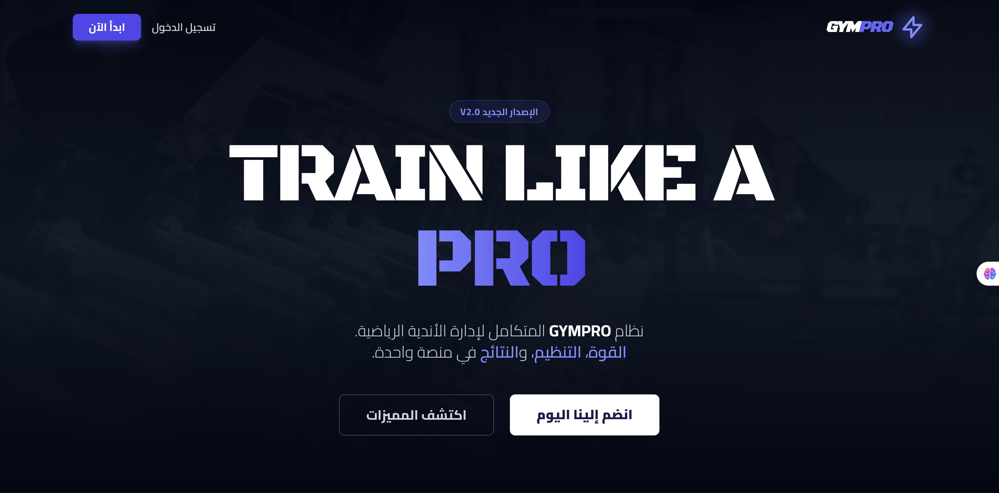
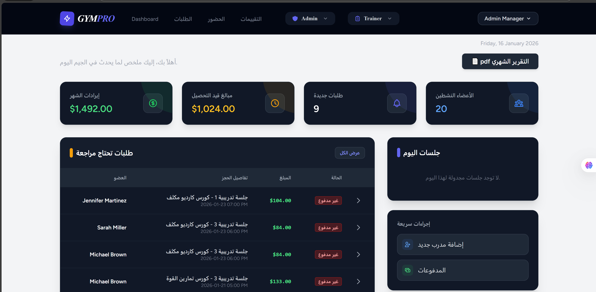
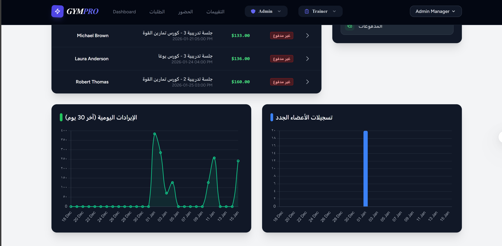
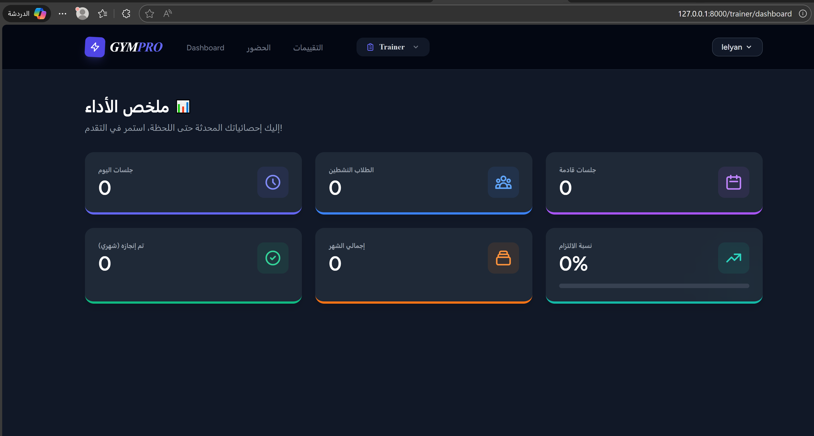
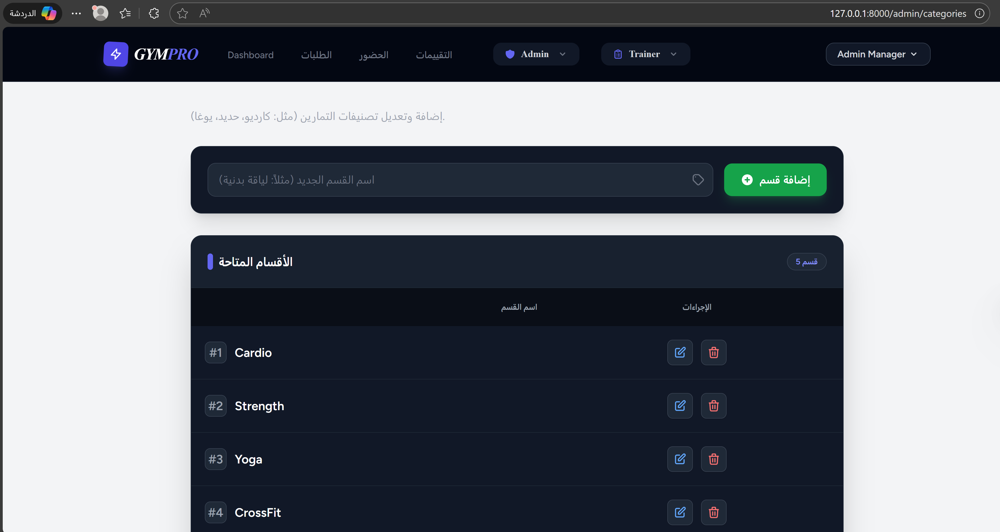
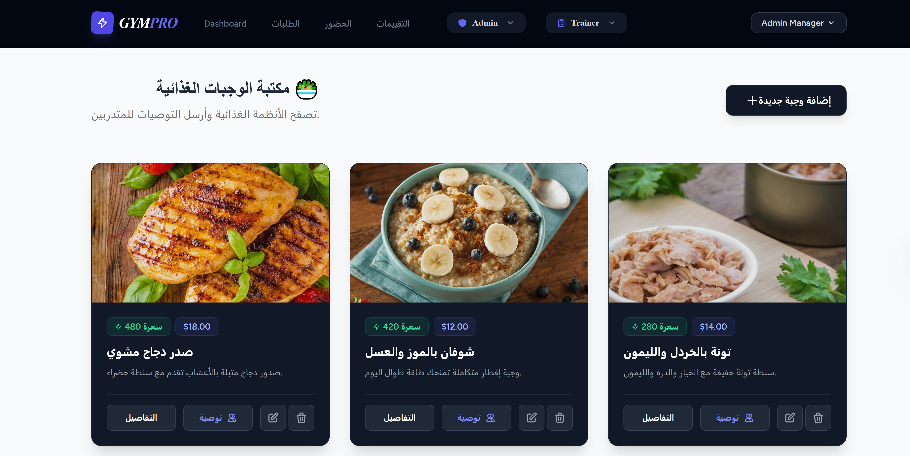
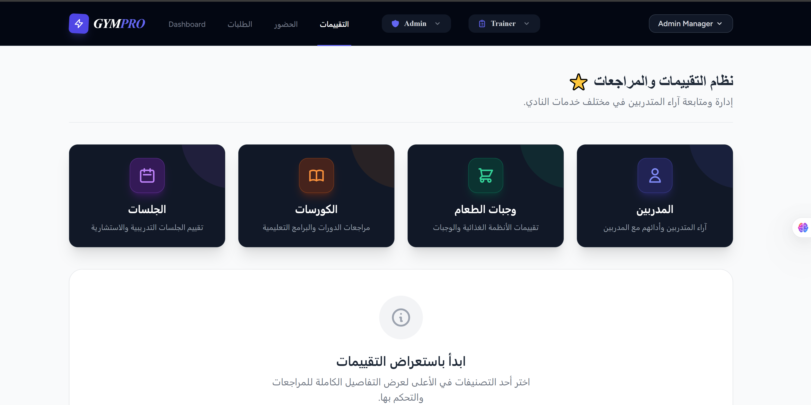
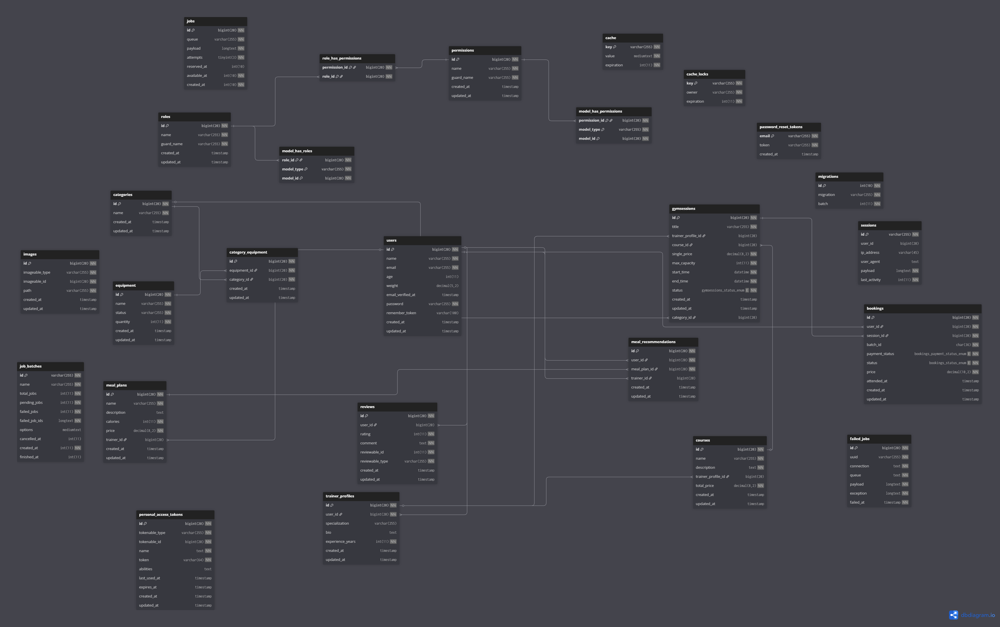

# 🏋️‍♂️Gym Management System

## 📝 Introduction
**Gym Management System** is a Laravel-based web application that helps manage gym operations such as courses, trainers, categories, and sessions. It provides a clean API and Blade views with unified responses, making the system scalable, maintainable, and easy to use for both administrators and users.

## 📸 Screenshots









## 📝 Project Review

The Gym Management System is a full-stack Laravel application designed to manage all core gym operations,
including user management, trainers, gym sessions, bookings, attendance,
meal plans, reviews, and monthly reports.
It provides a web-based admin dashboard and a RESTful API for members and trainers.
The system focuses on scalability, security, and real-world business logic.

## ⚙️ Project Properties

-   🧱 Framework: Laravel 12
-   💻 Programming Language: PHP 8.2
-   🏗 Architecture: MVC (Model-View-Controller)
-   🔐 Authentication: Laravel Sanctum
-   🧩 Authorization: Role-Based Access Control (Spatie Laravel Permission)
-   🗄 Database: MySQL
-   🔗 API Type: RESTful API
-   🎨 Frontend: Blade Templates with Tailwind CSS
-   📄 Reporting: PDF Generation (DomPDF)
-   🤖 External Services: Telegram Bot API

## 📦 Installation

1. 📥 Clone the repository:

    ```bash
    git clone https://github.com/aliyounes606/gym-management-system.git
    ```

2. 📂 Navigate to the project directory:

    ```bash
    cd gym-management-system
    ```

3. 📦 Install backend dependencies:

    ```bash
    composer install
    ```

4. 🎨 Install frontend dependencies:

    ```bash
    npm install
    ```

    ## 🛠 Setup

5. 📄 Create environment file:

    ```bash
    cp .env.example .env
    ```

6. 🔑 Generate application key:

    ```bash
    php artisan key:generate
    ```

7. 🗄 Configure database credentials inside the .env file.

8. 📊 Run database migrations and seeders:

    ```bash
    php artisan migrate --seed
    ```

9. 🔗 Create storage symbolic link:

    ```bash
    php artisan storage:link
    ```

    ## ▶️ Run the Application

🚀 Start the Laravel development server:

```bash
php artisan serve
```

🎨 Compile frontend assets:

```bash
npm run dev
```

## 📦 Packup

Before submitting or deploying the project:

🧹 Clear and cache configuration:

```bash
php artisan config:cache
```

🛣 Cache application routes:

```bash
php artisan route:cache
```

👁 Cache compiled views:

```bash
php artisan view:cache
```

⚠️ Ensure production environment settings:
APP_ENV=production
APP_DEBUG=false

## 🗂 Database Schema (ERD)

Here is the Entity Relationship Diagram for the Gym Management System:

[](https://dbdiagram.io/d/last-erd-694d6ba2b8f7d868861f3a61)

> **Note:** Click on the image to view the interactive diagram.

## 📚 API Documentation

### 🔐 Authentication

| Method | Endpoint | Description |
| :--- | :--- | :--- |
| `POST` | `/api/register` | Register a new user |
| `POST` | `/api/login` | User login |
| `POST` | `/api/logout` | Logout (Token required) |

### 📅 Bookings

| Method | Endpoint | Description |
| :--- | :--- | :--- |
| `POST` | `/api/bookings/single` | Book a single session |
| `POST` | `/api/bookings/course` | Book a full course (Bulk) |

### ✅ Attendance

| Method | Endpoint | Description |
| :--- | :--- | :--- |
| `POST` | `/api/attendance/mark` | Mark member attendance |

### 🥗 Meal Plans

| Method | Endpoint | Description |
| :--- | :--- | :--- |
| `GET` | `/api/meals` | List all available meal plans |
| `GET` | `/api/meals/my-plans` | List my assigned meal plans |

### 🏋️ Courses & Sessions

| Method | Endpoint | Description |
| :--- | :--- | :--- |
| `GET` | `/api/courses` | List all available courses |
| `GET` | `/api/courses/{id}` | Get details of a specific course |
| `GET` | `/api/gymsessions` | List all sessions (**Supports Filtering**) |
| `GET` | `/api/gymsessions/{id}` | Get details of a specific session |

#### 🔍 Filtering Sessions 

You can filter the **Gym Sessions** list by adding query parameters to the URL:

| Parameter | Example Usage | Description |
| :--- | :--- | :--- |
| `trainer_id` | `/api/gymsessions?trainer_id=1` | Filter by specific **Trainer** |
| `course_id` | `/api/gymsessions?course_id=5` | Filter by specific **Course** |
| `category_id` | `/api/gymsessions?category_id=3` | Filter by specific **Category** |

### ⭐ Reviews & Ratings

| Method | Endpoint | Description |
| :--- | :--- | :--- |
| `POST` | `/api/course/{id}/review` | Submit a review for a **Course** |
| `POST` | `/api/trainer/{id}/review` | Submit a review for a **Trainer** |
| `POST` | `/api/mealplan/{id}/review` | Submit a review for a **Meal Plan** |
| `POST` | `/api/gymsession/{id}/review` | Submit a review for a **Gym Session** |


## 📄 Sample Responses 

### Single Session Booking Response:
```json
{
    "message": "تم استلام طلب الحجز. يرجى التوجه للاستقبال للدفع لتفعيل الحجز.",
    "booking_reference": "a1b2c3d4-e5f6-7890-1234-567890abcdef",
    "data": {
        "id": 102,
        "user_id": 15,
        "session_id": 5,
        "price": "50.00",
        "status": "pending",
        "payment_status": "unpaid",
        "created_at": "2026-01-17T10:30:00.000000Z"
    }
}
```

### Get Gym Sessions List Response:

```json
{
    "data": [
        {
            "id": 1,
            "name": "Morning Yoga",
            "start_time": "2026-01-18 08:00:00",
            "end_time": "2026-01-18 09:30:00",
            "capacity": 20,
            "current_bookings": 5,
            "trainer": {
                "id": 3,
                "name": "Coach Sarah",
                "specialization": "Yoga & Pilates"
            },
            "category": {
                "id": 2,
                "name": "Flexibility"
            }
        },
        {
            "id": 2,
            "name": "Heavy Lifting",
            "start_time": "2026-01-18 18:00:00",
            "end_time": "2026-01-18 19:30:00",
            "capacity": 15,
            "current_bookings": 15,
            "is_full": true,
            "trainer": {
                "id": 5,
                "name": "Captain Ali",
                "specialization": "Bodybuilding"
            }
        }
    ]
}
```

